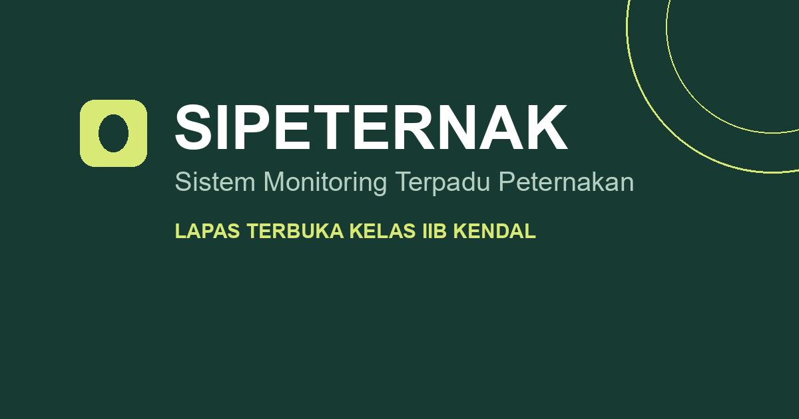
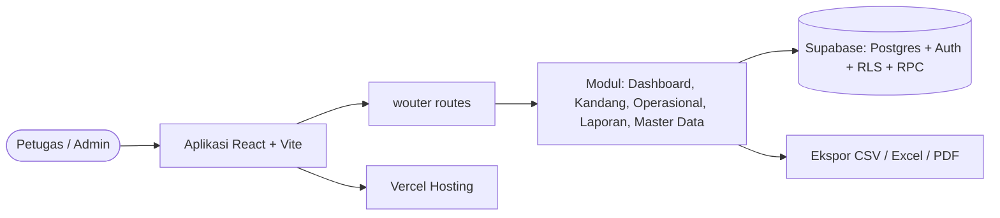

<div align="center">


# SIPETERNAK

[](https://github.com/idugeni/sipeternak)

Satu ruang kerja untuk memantau populasi, pakan, produksi, kesehatan ternak, dan laporan harian — dengan jejak audit penuh.



[](https://github.com/idugeni/sipeternak/blob/main/package.json)
[](./LICENSE)
[](https://github.com/idugeni/sipeternak/commits/main)
[](https://github.com/idugeni/sipeternak/stargazers)
[](https://github.com/idugeni/sipeternak/issues)
[](https://sipeternak.vercel.app)
[](./CONTRIBUTING.md)

[🚀 Live Demo](https://sipeternak.vercel.app) · [📖 Dokumentasi](./docs/ARCHITECTURE.md) · [🐞 Lapor Issue](https://github.com/idugeni/sipeternak/issues) · [📋 Changelog](./CHANGELOG.md)

</div>

---

## ✨ Fitur Utama

| Modul                     | Kemampuan                                                               |
| ------------------------- | ----------------------------------------------------------------------- |
| 📊 **Dashboard**          | Metrik populasi, tren 30 hari, produksi mingguan, peringatan stok pakan |
| 🏠 **Kandang & Kelompok** | CRUD kandang, filter jenis/status, paginasi, ekspor CSV/Excel/PDF       |
| 🌾 **Operasional**        | Transaksi pakan, produksi, dan kesehatan ternak tervalidasi per peran   |
| 📝 **Laporan Harian**     | Monitoring kondisi kandang per hari + riwayat & verifikasi 30 hari      |
| 🗂️ **Master Data**        | Jenis ternak, jenis pakan, tipe produksi terpusat                       |
| 🛡️ **Audit Log**          | Jejak aktivitas setiap pengguna, siap ekspor                            |
| 🔐 **Peran & Akses**      | Admin vs Petugas — aksi sensitif terkunci di UI dan database (RLS)      |

## 🧰 Tech Stack

<div align="center">

[](https://github.com/idugeni/sipeternak)


</div>

- **Frontend** — React 19 + Vite 8 + TypeScript 7 + Tailwind CSS 4 + shadcn/ui (Radix) + Lucide Icons + wouter
- **Backend** — Supabase (PostgreSQL + Auth + RLS) — lihat [`docs/DATABASE_STANDARDS.md`](./docs/DATABASE_STANDARDS.md)
- **Kualitas** — Vitest (unit + integrasi staging), `tsc --noEmit`, Prettier

<div align="center">

[](https://github.com/idugeni/sipeternak)

</div>

## 🏗️ Arsitektur



> Rincian lengkap ada di [`docs/ARCHITECTURE.md`](./docs/ARCHITECTURE.md).

## 🚀 Mulai Cepat

```bash
# 1. Klon & instal (Node 24)
git clone https://github.com/idugeni/sipeternak.git
cd sipeternak
npm ci

# 2. Konfigurasi environment
cp .env.example .env
# → isi NEXT_PUBLIC_SUPABASE_URL & NEXT_PUBLIC_SUPABASE_PUBLISHABLE_KEY

# 3. Jalan!
npm run dev      # dev server
npm run build    # build produksi → dist/
npm run preview  # pratinjau hasil build
```

| Script           | Fungsi                                               |
| ---------------- | ---------------------------------------------------- |
| `npm run dev`    | Vite dev server                                      |
| `npm run build`  | Build produksi                                       |
| `npm run check`  | Type-check (`tsc --noEmit`)                          |
| `npm run test`   | Vitest (unit; integrasi bila ada kredensial staging) |
| `npm run format` | Prettier seluruh repo                                |

> Detail environment & deployment ada di [`.env.example`](./.env.example) dan [`docs/RUNBOOK.md`](./docs/RUNBOOK.md).

<details>
<summary><b>🗂️ Struktur Proyek</b></summary>

```
src/
├── features/        # Modul per domain (dashboard, cages, operations, ...)
│   ├── auth/        # LoginScreen
│   ├── shell/       # Dashboard shell: sidebar, header, notifikasi
│   └── shared/      # Tipe, navigasi, skeleton
├── components/ui/   # Komponen shadcn/ui (jangan diubah manual)
├── lib/             # Supabase client, format, export (CSV/Excel/PDF)
├── pages/           # Home, NotFound
└── index.css        # Tema + token desain SIPETERNAK
supabase/migrations/ # Migrasi database berversi
tests/               # Tes integrasi Supabase (staging only)
docs/                # Arsitektur, standar DB, runbook, checklist E2E
```

</details>

## 🗺️ Roadmap

- [x] Dashboard, kandang, operasional, laporan harian, master data
- [x] Audit log + ekspor CSV/Excel/PDF + suite tes
- [ ] Mode offline / PWA untuk pencatatan lapangan
- [ ] Notifikasi real-time via Supabase Realtime
- [ ] Dasbor analitik lanjutan (tren musiman, proyeksi pakan)

## ❓ FAQ

<details>
<summary><b>Apakah aplikasi bisa jalan tanpa Supabase?</b></summary>

Belum. Login dan seluruh data membutuhkan `NEXT_PUBLIC_SUPABASE_URL` + `NEXT_PUBLIC_SUPABASE_PUBLISHABLE_KEY` — tombol masuk nonaktif sampai keduanya terisi.

</details>

<details>
<summary><b>Bagaimana peran Admin vs Petugas ditegakkan?</b></summary>

Dua lapis: UI menyembunyikan/menonaktifkan aksi sensitif, dan database menegakkannya lewat RLS + trigger pengunci peran. Lihat [`docs/DATABASE_STANDARDS.md`](./docs/DATABASE_STANDARDS.md).

</details>

<details>
<summary><b>Bagaimana cara menjalankan tes integrasi?</b></summary>

Tes integrasi hanya menyentuh **staging/branch**, tidak pernah produksi. Isi kredensial staging di environment, lalu `npm test`. Detailnya di [`docs/RUNBOOK.md`](./docs/RUNBOOK.md).

</details>

## 🤝 Kontribusi

Baca [`CONTRIBUTING.md`](./CONTRIBUTING.md) — mencakup alur branch, konvensi commit, dan checklist PR. Isu keamanan? Lihat [`SECURITY.md`](./SECURITY.md).

## 📄 Lisensi

[MIT](./LICENSE) © 2026 Eliyanto Sarage

<div align="center">

⬆️ [Kembali ke atas](#sipeternak)

</div>
